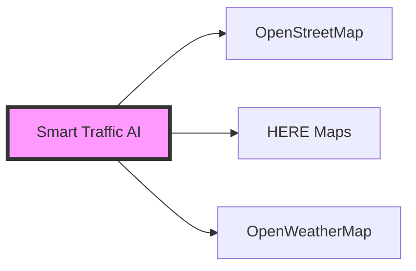
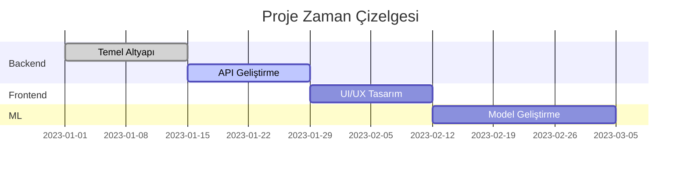

# 🚦 Smart Traffic AI


> 🌟 Yapay zeka destekli gerçek zamanlı trafik analiz ve tahmin sistemi

## 📋 İçindekiler

- [Proje Hakkında](#-proje-hakkında)
- [Özellikler](#-özellikler)
- [Teknolojiler](#-teknolojiler)
- [Başlangıç](#-başlangıç)
- [API Dokümantasyonu](#-api-dokümantasyonu)
- [Katkıda Bulunma](#-katkıda-bulunma)
- [Lisans](#-lisans)

## 🎯 Proje Hakkında

Smart Traffic AI, yapay zeka ve gerçek zamanlı veri analizi kullanarak trafik akışını optimize etmeyi amaçlayan yenilikçi bir projedir. Sistem, çeşitli veri kaynaklarını kullanarak trafik yoğunluğunu tahmin eder ve sürücülere optimum rotalar önerir.

### 🌟 Temel Özellikler

| Özellik | Açıklama |
|---------|-----------|
| 📊 Gerçek Zamanlı Analiz | OpenStreetMap ve HERE Maps API entegrasyonu ile anlık trafik verisi |
| 🤖 AI Tahminleri | TensorFlow Lite tabanlı trafik yoğunluğu tahminleri |
| 🗺️ İnteraktif Harita | Kullanıcı dostu harita arayüzü ve rota görselleştirme |
| 🌤️ Hava Durumu Entegrasyonu | OpenWeatherMap ile hava koşulları analizi |
| 📱 Mobil Uyumluluk | Responsive tasarım ile her cihazda kusursuz deneyim |

## 💻 Teknolojiler

### Backend Teknolojileri
```python
{
    "ana_framework": "FastAPI",
    "veritabanı": "PostgreSQL",
    "cache": "Redis",
    "AI/ML": ["TensorFlow Lite", "Scikit-learn"]
}
```

### Frontend Teknolojileri
```javascript
{
    "framework": "Next.js",
    "harita": "OpenStreetMap + Leaflet",
    "UI": "TailwindCSS",
    "state": "React Query"
}
```

### Harici Servisler


## 🚀 Başlangıç

### Ön Gereksinimler

- Python 3.8+
- PostgreSQL
- Redis
- Node.js 16+

### Kurulum

1. Repo'yu klonlayın:
```bash
git clone https://github.com/yourusername/smart-traffic-ai.git
cd smart-traffic-ai
```

2. Python sanal ortamı oluşturun:
```bash
python -m venv venv
source venv/bin/activate  # Linux/Mac
venv\Scripts\activate     # Windows
```

3. Bağımlılıkları yükleyin:
```bash
pip install -r src/backend/requirements.txt
```

4. Çevre değişkenlerini ayarlayın:
```bash
cp .env.example .env
# .env dosyasını düzenleyin
```

5. Veritabanını oluşturun:
```bash
cd src/backend
alembic upgrade head
```

6. Uygulamayı başlatın:
```bash
python run.py
```

## 📚 API Dokümantasyonu

API endpoint'lerine erişim için: `http://localhost:8000/docs`

### Örnek İstekler

#### Trafik Akışı
```python
GET /api/v1/traffic/flow
params: {
    "bbox": [lat1, lon1, lat2, lon2]
}
```

#### Rota Optimizasyonu
```python
GET /api/v1/route/optimize
params: {
    "start_lat": float,
    "start_lon": float,
    "end_lat": float,
    "end_lon": float
}
```

## 🌟 Özellikler ve Yol Haritası

### Mevcut Özellikler
- ✅ PostgreSQL entegrasyonu
- ✅ OpenStreetMap entegrasyonu
- ✅ HERE Maps entegrasyonu
- ✅ OpenWeatherMap entegrasyonu
- ✅ Temel API endpoint'leri

### Geliştirme Aşamasında
- 🔄 Redis cache implementasyonu
- 🔄 Authentication sistemi
- 🔄 Frontend geliştirme
- 🔄 ML model entegrasyonu

### Planlanmış Özellikler
- 📅 Gerçek zamanlı trafik uyarıları
- 📅 Mobil uygulama
- 📅 Toplu taşıma entegrasyonu
- 📅 Kullanıcı tercihleri ve geçmiş

## 🤝 Katkıda Bulunma

1. Fork'layın
2. Feature branch oluşturun (`git checkout -b feature/amazing-feature`)
3. Commit'leyin (`git commit -m '✨ Add amazing feature'`)
4. Push'layın (`git push origin feature/amazing-feature`)
5. Pull Request oluşturun

## 📊 Proje Durumu



## 📝 Lisans

Bu proje MIT lisansı altında lisanslanmıştır. Detaylar için [LICENSE](LICENSE) dosyasına bakın.

## 📞 İletişim

Proje Sahibi - [@yourusername](https://github.com/yourusername)

Proje Linki: [https://github.com/yourusername/smart-traffic-ai](https://github.com/yourusername/smart-traffic-ai)

---

<div align="center">
    
    
</div>

> 🔔 **Not:** Bu proje aktif geliştirme aşamasındadır. Katkılarınızı bekliyoruz! 