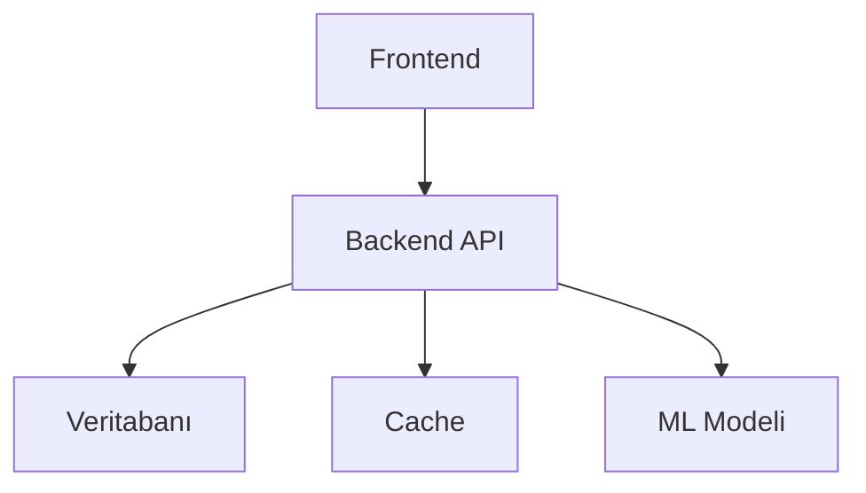
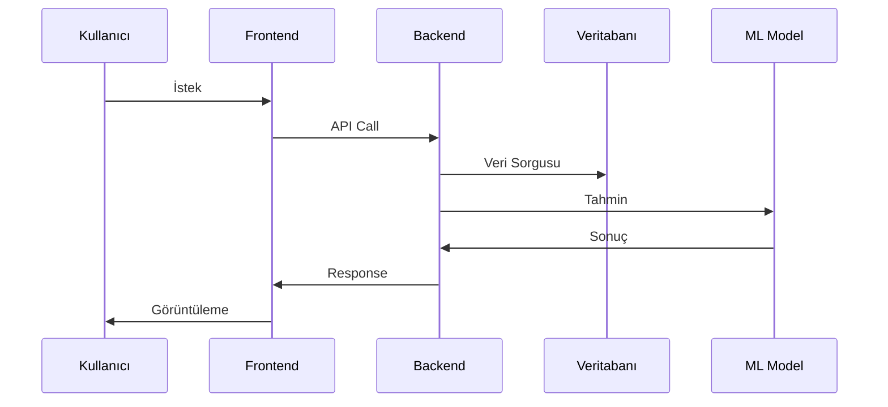
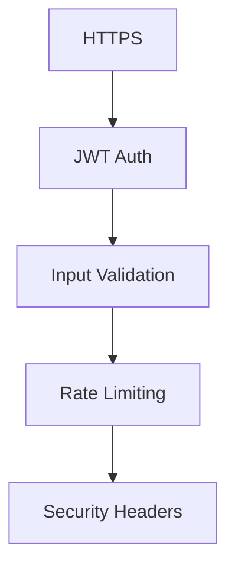
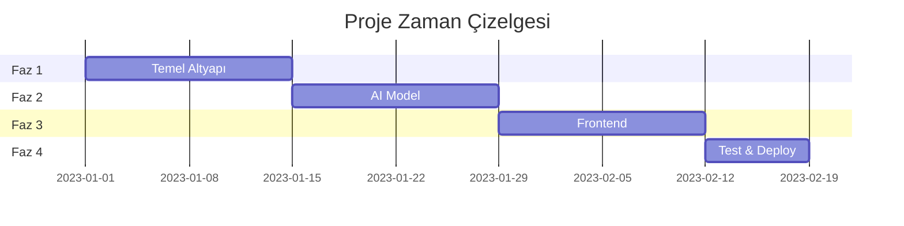

# 🚦 Gerçek Zamanlı Trafik Analiz ve Tahmin Sistemi

## 📋 İçindekiler
- [Proje Özeti](#-proje-özeti)
- [Teknoloji Stack](#-teknoloji-stack)
- [Mimari](#-mimari)
- [Geliştirme Fazları](#-geliştirme-fazları)
- [Optimizasyonlar](#-optimizasyonlar)
- [Güvenlik](#-güvenlik)
- [Başarı Kriterleri](#-başarı-kriterleri)

---

## 🎯 Proje Özeti

### 🚀 Vizyon
> Yapay zeka destekli, gerçek zamanlı trafik analizi ve tahmin sistemi geliştirerek, kullanıcılara akıllı rota önerileri ve trafik yoğunluk tahminleri sunmak.

### ⭐ Temel Özellikler
| Özellik | Açıklama |
|---------|-----------|
| 📊 Gerçek Zamanlı Analiz | Trafik verisi toplama ve analiz |
| 🤖 AI Tahminleri | Yapay zeka tabanlı yoğunluk tahminleri |
| 🗺️ İnteraktif Harita | Kullanıcı dostu harita arayüzü |
| 🛣️ Akıllı Rotalar | Optimum rota önerileri |
| 📱 Mobil Uyumluluk | Responsive tasarım |

---

## 💻 Teknoloji Stack

### Backend 🔧
```python
{
    "ana_framework": "FastAPI",
    "veritabanı": ["SQLite (Dev)", "PostgreSQL (Prod)"],
    "cache": "Redis",
    "validasyon": "Pydantic",
    "async_jobs": "Celery"
}
```

### Frontend 🎨
```javascript
{
    "framework": "Next.js",
    "harita": "OpenStreetMap",
    "styling": "TailwindCSS",
    "state_management": "React Query"
}
```

### AI/ML 🧠
```python
{
    "deployment": "TensorFlow Lite",
    "prototyping": "Scikit-learn"
}
```

### DevOps ⚙️
```yaml
deployment:
  - Docker
  - GitHub Actions
  - Vercel
```

---

## 🏗️ Mimari

### Monolitik-First Yaklaşımı


### Veri Akışı


---

## 📅 Geliştirme Fazları

### Faz 1: Temel Altyapı (2 Hafta)
- [x] Proje planlama
- [ ] OpenStreetMap API entegrasyonu
- [ ] Veritabanı şeması
- [ ] CRUD operasyonları
- [ ] Auth sistemi

### Faz 2: AI Model (2 Hafta)
- [ ] Veri toplama
- [ ] Model geliştirme
- [ ] Optimizasyon

### Faz 3: Frontend (2 Hafta)
- [ ] Next.js setup
- [ ] UI/UX
- [ ] Harita entegrasyonu

### Faz 4: Test & Deploy (1 Hafta)
- [ ] Testing
- [ ] Deployment
- [ ] Monitoring

---

## ⚡ Optimizasyonlar

### Frontend 🎨
<details>
<summary>Detayları Göster</summary>

#### Code Splitting
- Route-based
- Component-based
- Lazy loading

#### Asset Optimization
- Image optimization
- Font optimization
- CSS minification

#### Caching
- Service Worker
- PWA
- Browser cache
</details>

### Backend ⚙️
<details>
<summary>Detayları Göster</summary>

#### Database
- İndeksleme
- Query optimization
- Connection pooling

#### API
- Compression
- Pagination
- Batch işlemler
</details>

---

## 🔒 Güvenlik

### Temel Güvenlik Katmanları


### Güvenlik Kontrol Listesi
- [x] JWT Authentication
- [x] HTTPS
- [x] Input Validation
- [x] Rate Limiting
- [x] CORS
- [x] SQL Injection Protection
- [x] XSS Protection

---

## 📊 Başarı Kriterleri

### Performans Metrikleri
| Metrik | Hedef |
|--------|--------|
| 🚀 Sayfa Yüklenme | < 3s |
| ⚡ API Yanıt | < 500ms |
| 🎯 Model Doğruluk | > 85% |
| 📱 Lighthouse Score | > 90 |
| 🧪 Test Coverage | > 80% |

### Risk Yönetimi
| Risk | Çözüm |
|------|--------|
| 📡 Veri Kaynağı | Fallback & Cache |
| ⚡ Performans | Optimizasyon & CDN |
| 🔒 Güvenlik | Sürekli Audit |

---

## ⏱️ Zaman Çizelgesi


---

### 📝 Not
> Bu roadmap yaşayan bir dokümandır ve proje ilerledikçe güncellenecektir.

---

 